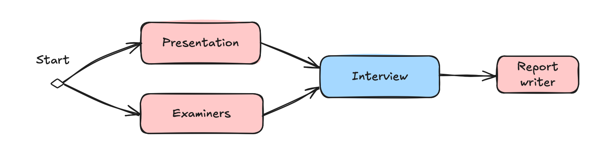
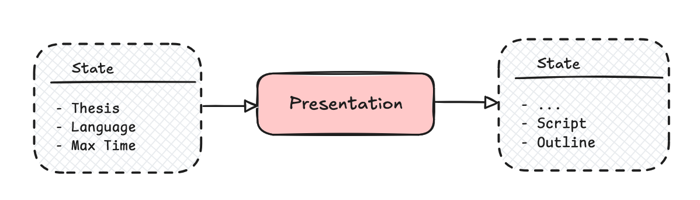
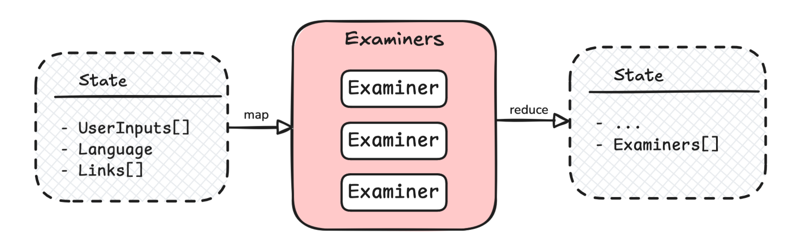
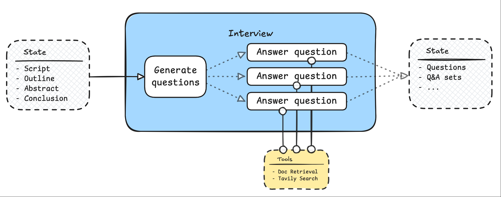
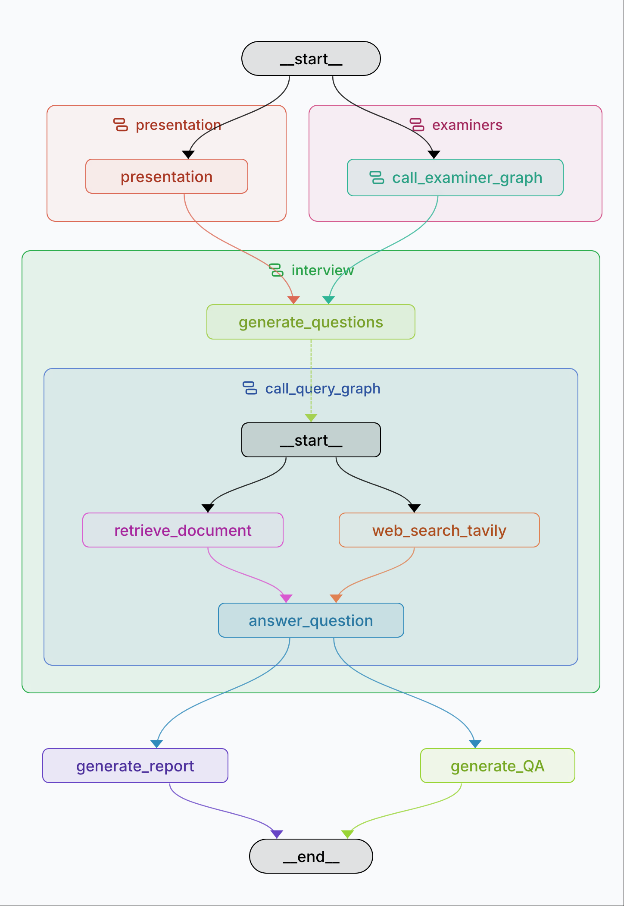

# Defend Your Thesis
I build a AI thesis defense system.

## TL;DR
This is a multi-agent system that mocks up the workflow of a thesis defense. It contains 4 main components:

- A presentation agent that help generate oral script and slides outlines based on the content of the thesis.
- An examiners agent that help generate personas to mimic the examiner or supervisor who will join the defense.
- An interview agent that mock up the Q&A session after you deliver your presentation.
- A report writer agent that write a report and likely Q&A for you.

## How i came up with this idea
My roomie who was writing his bachelor thesis. I also experienced this, researching and writing my master thesis is a very time consuming process and a lot of work. We want to make like easier. So i decided to build a AI multi-agent system to help people defend their thesis. But the things is that i planed a hiking in the arctic cirle in Sweden, so i decided to grab my laptop and build this along my hiking trip. Then, i found there is no internet connection during my trip, so i coded first and debuged later after i had access to the internet in my last stop in Kebnekaise Fjällstation. And i was also luck that happend to witness the moving of Kiruna Church.

OK, Let's back to business.

## Is this a good idea?
Some people may think I could do it with ChatGPT or Claude Desktop. Why you cost so many time and energy to build this?

Here we introduce a concept called "context engineering" and what scenario people should choose a self-tailored multi-agent system instead of mature tools like ChatGPT or Claude Desktop.

What's agent? Agent is a LLM model using tools in a loop or interact with the environment (give action and receive feedback/observation), then achieve a goal. Agents scale complex and valuable tasks. So here is an check-list provided from anthropic.

** Checklist: "Should I build an agent"
| Question | Answer |
| --- | --- |
| Is my task complex enough | No -> Workflows Yes -> Agents |
| Is my task valuable enough | Cheap -> Workflows Expensive -> Agents |
| Are all parts of the task doable | Yes -> Agents No -> Reduce scope |
| What is the cost of error/error discovery? | High -> Read-only/human-in-the-loop Low -> Agents |

Something need to be clearified is that apps like chatGPT or Claude Desktop are agents as well, but they are not self-tailored multi-agents. They are more like a elementary mono-agent.

[Prompting for Agents | Code w/ Claude](https://www.youtube.com/watch?v=XSZP9GhhuAc&t=1218s&ab_channel=Anthropic)

<iframe width="560" height="315" src="https://www.youtube.com/embed/XSZP9GhhuAc?si=3gw_xv0s7FmFeOB5&amp;start=94" title="YouTube video player" frameborder="0" allow="accelerometer; autoplay; clipboard-write; encrypted-media; gyroscope; picture-in-picture; web-share" referrerpolicy="strict-origin-when-cross-origin" allowfullscreen></iframe>

Now, it quite clear. This task is hard to be replaced by a hard-coded workflow.

### Next, What's Context Engineering?
Think of the process when you use chatGPT, you give it your tasks attached with the stuff need to be processed. Agents need context to perform tasks, in China there is a old saying, "巧妇难为无米之炊", literally it means a skillful woman can't cook without rice (food material). 

A lot people just pass all the context to the chatbox, but it's not a good idea. It's like you are cooking a meal just throw all the ingredients into the pot and stir it. That's obivious you will mess up the meal.

If you have a big task, Using a momo-prompt will cause numerous problems:

  - It soon will exceed the size of the context window
  - Every interaction you will feed this huge prompt along with new instructions into LLM again and again, this will lead to ballon cost and latency.

Instead, a best way to do this is use a multi-agent system to isolate your context, split your task into multiple subtasks and let each sub-agents maintain their own context. Yes, "Let Caesar have what is Caesar’s, and God what is God’s." If you have more interests in context engineering, you can check out this [article](https://blog.langchain.com/context-engineering-for-agents/) from langchain.

## Building

### Presentation agent

This step user will upload thesis file, and presentation agent will generate a oral script and slides outline based on the content of the thesis. In the future it will coordinate with some Slides generation Agent to generate slides, and generate a sound file with a TTS engine.

### Examiners agent
I think this is the most interesting part of this system. The LLM can generate a persona to mimic the examiner or supervisor who will join the defense. Here we define a persona with those four attributes:

- Name
- Personality
- Background
- Communication Style

Also, I introduce a map-reduce pattern to this sub-agent. The number of the examiners is not fixed, so i use a map-reduce pattern to generate questions. Langgraph provides a good tool called [Send](https://langchain-ai.lang.chat/langgraph/reference/types/#langgraph.types.Send) to help you implement this. 

### Interview agent

The interview agent will mock up the Q&A session after you deliver your presentation.

Phase 1: Generate Questions
	1.	Content accessible to examiners
	•	Access: Oral script, Abstract, Conclusion.
	•	Rationale: Examiners are typically busy and may not read the full thesis; providing these key sections ensures they understand the core contributions.
	2.	Balancing examiner background vs. thesis content
	•	Approach: Keep a human in the loop.
	•	Rationale: LLMs can predict likely questions but cannot perfectly weigh the examiner’s background against the thesis content. Human input ensures alignment with the intended focus (thesis-oriented vs. background-oriented questions).

Phase 2: Generate Answers
	1.	Workflow
	•	For each potential question, use a map-reduce style process to generate answers.
	2.	RAG Tools for Retrieval
	•	retrieve_document: Retrieves relevant thesis content from a vector database (e.g., Chroma) based on the question. Useful for thesis-focused answers.
	•	web_search_tavily: Retrieves relevant online content related to the examiner’s background. Useful for answers tailored to the examiner’s expertise.
	3.	Answer Generation
	•	Combine retrieved content from both tools into a structured prompt.

### Report writer agent
The report writer agent will write a report and likely Q&A for you.

[Git Repo](https://github.com/baixianger/Defend-your-thesis)